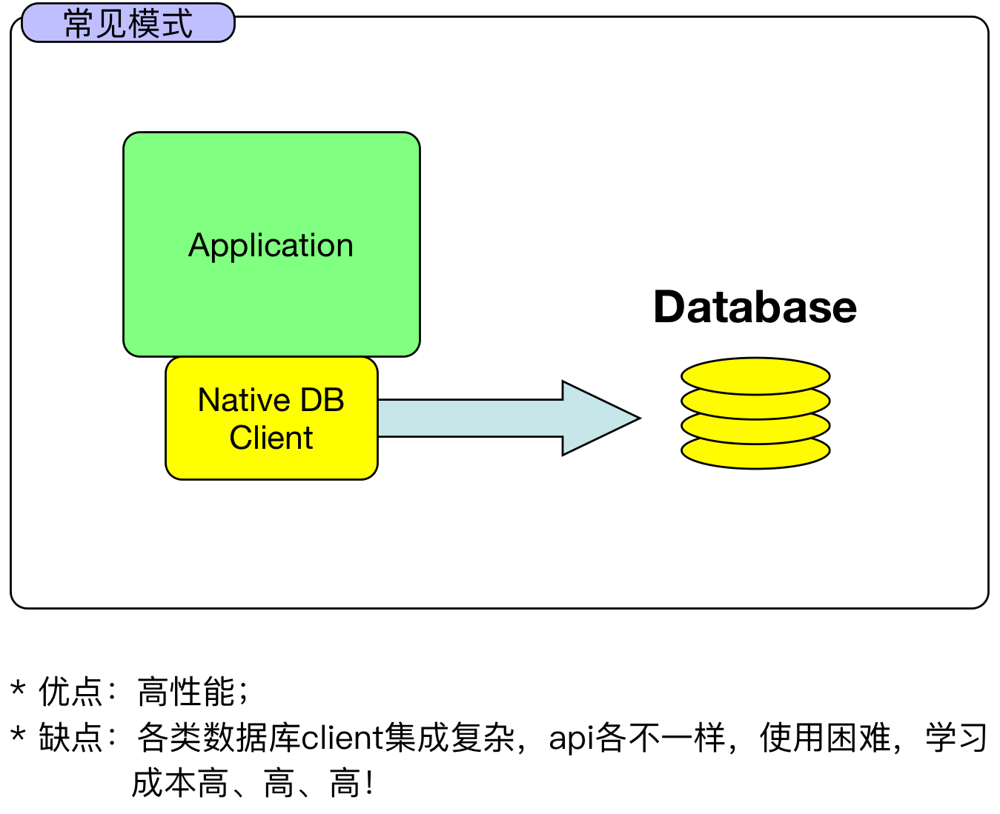
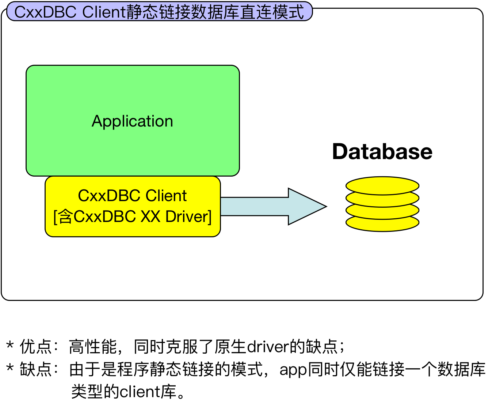
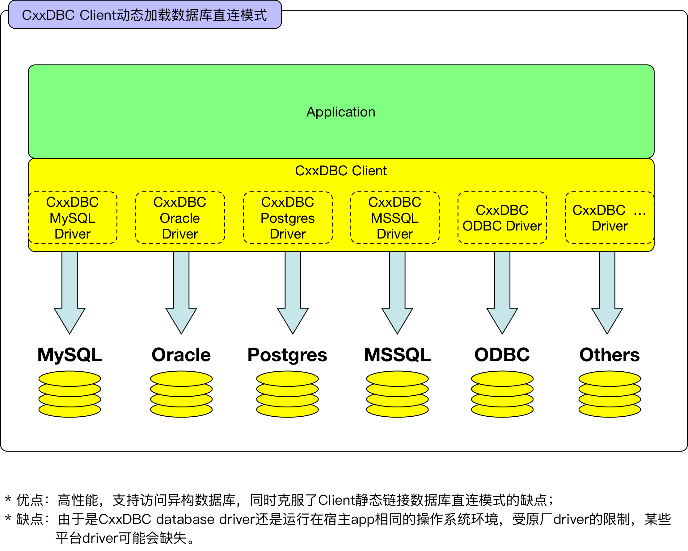
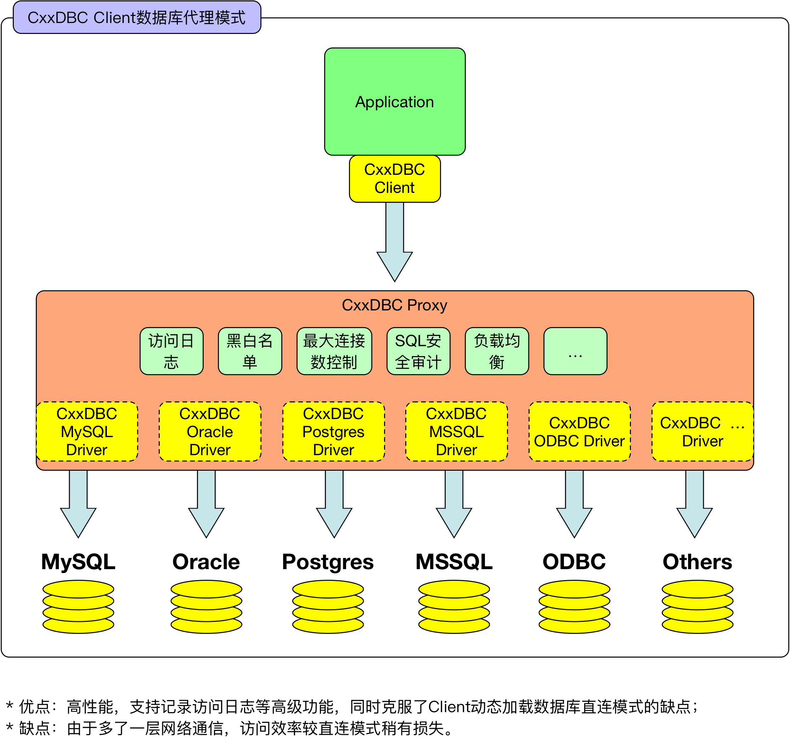

# CxxDBC

##基于C++开发的异种数据库跨平台连接中间件.


### 目录
  * [特点](#特点)
  * [示例](#示例)
  * [架构](#架构)
  * [集成](#集成)
  * [依赖](#依赖)
  * [TODO](#todo)
  * [Support](#support)

####特点

* 统一接口，支持各类异种数据库的连接访问；

* c++ client API参考jdbc，简洁易用；

* c++ client支持数据库连接池；

* c++ client支持`静态链接数据库直连`、`动态加载数据库直连`、`dbproxy代理访问`、`混合访问模式`等多种模式；

* 使用`dbproxy代理进行数据库连接`模式时，支持黑白名单、SSL安全连接、最大连接数控制、SQL访问记录、（SQL安全审计、读写分离等高级功能持续开发中...）；

* client语言支持列表：

  | 语言   | 支持情况 |
  | ---- | ---- |
  | c++  | 支持   |
  | 其他   | TODO |

* 数据库支持列表：

  | 数据库        | 读、写  | 多结果集 | 批量写  | 存储过程 | LOB读写 | 参数绑定 | 事务   | 限制                      |
  | ---------- | ---- | ---- | ---- | ---- | ----- | ---- | ---- | ----------------------- |
  | MySQL      | 支持   | 支持   | 支持   | 支持   | 支持    | 支持   | 支持   | 存储过程仅支持结果集返回            |
  | PostgreSQL | 支持   | 支持   | 支持   | 支持   | 支持    | 支持   | 支持   | 存储过程仅支持结果集返回            |
  | Oracle     | 支持   | 支持   | 支持   | 支持   | 支持    | 支持   | 支持   | 存储过程仅支持游标返回             |
  | MSSQL      | 支持   | 支持   | 支持   | 支持   | 支持    | 支持   | 支持   | 存储过程仅支持结果集返回，且不支持参数绑定模式 |
  | Sybase     | 支持   | 支持   | 支持   | 支持   | 支持    | 支持   | 支持   | 存储过程仅支持结果集返回，且不支持参数绑定模式 |
  | 其他         | TODO | TODO | TODO | TODO | TODO  | TODO | TODO |                         |

####示例
  `c++:`

  ```
  #include "Edb.hh"
  #include "ELog.hh"
  
  #define LOG(fmt,...) ESystem::out->println(fmt, ##__VA_ARGS__)

  #define HOST "127.0.0.1"
  #define PORT "6633"
  #define DATABASE "test"
  #define USERNAME "test"
  #define PASSWORD "password"
  
  static void test_db_execute() {
	EConnection conn; //默认使用proxy模式
	conn.connect(DATABASE, HOST, atoi(PORT), USERNAME, PASSWORD);

	ECommonStatement stmt(&conn);
	EResultSet* rs;

	//0.
	try {
		stmt.setSql("DROP TABLE mysql000").execute();
	} catch (...) {
	}
	stmt.setSql("CREATE TABLE mysql000 ("
				  "id integer NULL,"
				  "name varchar (40) NULL ,"
				  "date date NULL"
				  ") type=InnoDB").execute();

	//1.
	stmt.setSql("insert into mysql000 values(?,?,?)")
				.bindInt(4)
				.bindString("1")
				.bindString("2017-07-08");
	for (int i=0; i<100; i++) {
		stmt.execute();
	}

	//2.
	stmt.setSql("select * from mysql000").execute();
	rs = stmt.getResultSet();
	EResultSetMetaData* rsm = rs->getMetaData();
	LOG(rsm->toString().c_str());
	while (rs->next()) {
		for (int i=1; i<=rs->getMetaData()->getColumnCount(); i++) {
			LOG("%s:%s", rs->getMetaData()->getColumnLabel(i).c_str(), rs->isNull(i) ? "is null" : rs->getString(i).c_str());
		}
	}
	rs->close();

	conn.close();
  }

  int main(int argc, const char **argv) {
    // CxxJDK init.
    ESystem::init(argc, argv);
    // CxxLog4j init.
    ELoggerManager::init("log4e.properties");
        
    try {
		test_db_execute();
	}
	catch (ESQLException& e) {
		e.printStackTrace();
	}
	catch (...) {
		printf("catch all...\n");
	}
    
    ESystem::exit(0);
    
    return 0;
  }
  
  ```

更多示例： 
[esql.cpp](apps/esql/esql.cpp)
[mssql.cpp](client/cpp/test/mssql.cpp)
[mysql.cpp](client/cpp/test/mysql.cpp)
[oracle.cpp](client/cpp/test/oracle.cpp)
[postgres.cpp](client/cpp/test/postgres.cpp)
[sybase.cpp](client/cpp/test/sybase.cpp)

####架构
* 非CxxDBC常见模式：

  

  ​

* CxxDBC模式一：`静态链接数据库直连`

  

  ​

* CxxDBC模式二：`动态加载数据库直连`

  

  ​

* CxxDBC模式三：`dbproxy代理访问`

  

  ​

* CxxDBC模式四：`混合访问模式`
  集合`模式二`和`模式三`的混合模式，图略。
  ​

####集成
详见[使用指南](doc/Guide.md)


####依赖
1. [CxxJDK](https://github.com/cxxjava/CxxJDK)
2. [CxxLog4j](https://github.com/cxxjava/CxxLog4j)
3. [CxxConet](https://github.com/cxxjava/CxxConet)


####TODO
1. SQL安全审计；
2. ...

####Support
Email: [cxxjava@163.com](mailto:cxxjava@163.com)

